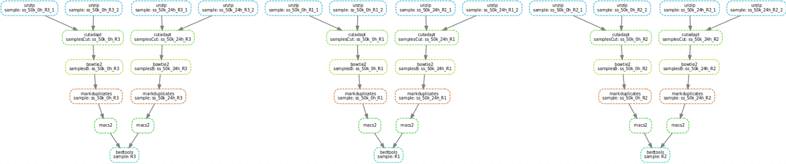

# TP_WF_Snakemake

The purpose of this project is to execute the same analysis worflow describe in the HPC project in this github in another way.
Here we use Snakemake to execute the workflow in a Cloud called ifb‑aubi‑oscar with 8 cores, 32 Go of memory and 128 Go of stockage.

**cloud deployment access ssh : ubuntu@193.49.167.105**

**appliance : BioPipes**

Since we use snakemake, we must activate it by:
```
conda activate snakemake
```


The main snakemake file is **Snakefile_WF_withOpenJDK**

A code quality checker have been used for Snakefile_WF_withOpenJDK to analyze the workflow and highlights issues that should be solved in order to follow best practices, achieve maximum readability, and reproducibility. The linter can be invoked with:
```
snakemake --lint --snakefile Snakefile_WF_withOpenJDK
```
We just haven't gave a conda environment for te rule unzip.

## To run the entire workflow, with **Snakefile_WF_withOpenJDK**, the command line is:

```
snakemake --use-conda --cores all  --snakefile Snakefile_WF_withOpenJDK
```
**Snakefile_WF_withOpenJDK** keep all the intermediate files.

For keeping just the importants files, run the worflow with 


The workflow will create log files (in the log directory) and benchmark files (in the benchmark directory) to give you some informations.

Others snakefiles contain just a specific rule or a part of the workflow. The file Snakemake_WF is an alternative workflow without the DeepTools analysis.

All the files env.yaml and config.yaml are in the config directory.

All the data come from  student22@193.49.167.88 :

Genome:
> /home/users/shared/databanks/bio/ncbi/genomes/Mus_musculus/Mus_musculus_GRCm38.p6/Mus_musculus_2020-7-9/fasta/

and must be in this directory:
> ./data/mydatalocal/atacseq/genome

Indexes : 
> /home/users/shared/databanks/bio/ncbi/genomes/Mus_musculus/Mus_musculus_GRCm38.p6/Mus_musculus_2020-7-9/bowtie2/

and must be in this directory:
> ./data/mydatalocal/atacseq/indexes/bowtie2

All  the fastq.gz files must be in :
> ./data/mydatalocal/atacseq/subsets

The DAG view obtained by:
```
sudo apt install graphviz
```
```
snakemake --dag results/bedtools/{R1,R2,R3}_0h_24h_common_peaks.bed | dot -Tsvg > dag.svg
```


# Snakemake Rules:

Individual steps are almost still the same.

## Unzip fastq files
>rule unzip:

Unzip fastq files

## Initial quality control 
>rule fastqc_init:

Uses fastqc to execute a quick initial quality control of the sequencing results. Takes fastq input by default.

## Trimming 
>rule cutadapt:

Removal of adapters via cutadaptc. If you wish to use this for another analysis with similar workflow, be sure to change the adapter sequences used as needed. Takes fastq input, gives fastq output.

**Here a wrapper have been used just to investigate a little bit further on how this function work...** 

## Post-trimming quality control 
>rule fastqc_post:

Once trimming has been finished, another quality control step is executed, via fastqc once again. Takes fastq input.

## Alignment with reference genome  
>rule bowtie2:

In this step bowtie2 is used to align the sequencing results with the reference genome, then samtools is used for file conversion (sam -> bam) and sorting. Takes bt2 (ref genome index) and fastq (sequencing data) input, gives bam output.

## Exploration via deepTools 
>rule deeptools:

This step produces plots to analyse correlation and coverage for the now aligned sequencing data, through the use of python-coded deepTools. Takes bam input, provides pdf files for plots, and a .tab correlation matrix file.

## Removal of duplicates  
>rule markduplicates:

Picard is used here, specifically the MarkDuplicates tool. It is used with the REMOVE_DUPLICATES option set to true so that the result files have the duplicates removed rather than just marked. Takes bam input, gives bam (data with duplicated removed) and txt (info on duplicates) output.


## Identification of DNA accessibility sites 
>rule macs2:

The MACS2 callpeak tool is used to find the accessibility sites within the aligned sequencing data. Takes bam input, gives narrowPeak, wig, and bed output.
Comparison of DNA accessibility sites between conditions

## Comparison of DNA accessibility sites between conditions
>rule bedtools:

Obtains via bedtools, from MACS2 callpeak results, the unique/common accessibility sites between conditions (T0h and T24h). Takes bed input, gives bed output.


